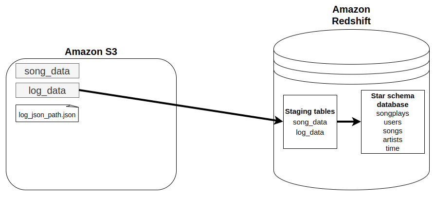
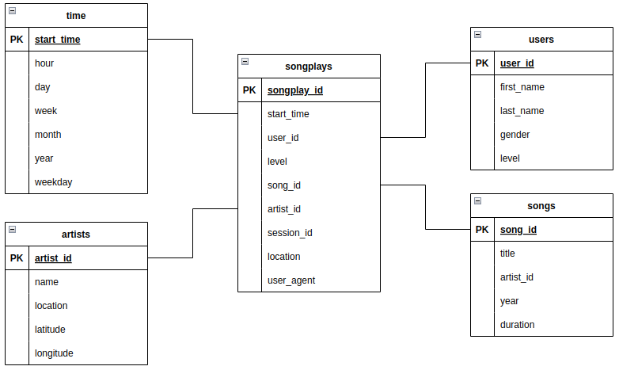

# Project: Redshift Data Warehouse

## Table of contents
* [Introduction](#introduction).
* [Data sources](#data-sources).
  * [Song dataset](#song-dataset).
  * [Log dataset](#log-dataset).
* [Project structure](#project-structure).
* [Schema design for song play analysis](#schema-design-for-song-play-analysis).
* [How to run](#how-to-run).
  * [Configuration file](#configuration-file).
  * [Redshift cluster setup](#redshift-cluster-setup).
  * [Table schemas creation](#table-schemas-creation).
  * [Data loading](#data-loading).
  * [Song play analysis](#song-play-analysis).
  * [Cluster resources cleanup](#cluster-resources-cleanup).

## Introduction

A music streaming startup, *Sparkify*, has grown their user base and song database and want to move their processes and data onto the cloud. Their data resides in S3, in a directory of JSON logs on user activity on the app, as well as a directory with JSON metadata on the songs in their app.

In this project, we are going to create an ETL pipeline for a database hosted on Redshift. For that, we will make use of two AWS resources:
* [Amazon S3](https://aws.amazon.com/s3/).
* [Amazon Redshift](https://aws.amazon.com/redshift/).
  
The goal of the project is to build an ETL pipeline that extracts Sparkify's data from S3, stages it in Redshift, and transforms it into a set of dimensional tables for their analytics team to continue finding insights in what songs their users are listening to.




## Data sources

The data sources to ingest into the data warehouse reside in two public S3 buckets.

### Song dataset 

Located in `s3://udacity-dend/song_data`. It's a subset of real data from the [Million Song Dataset](http://millionsongdataset.com/). Each file is in JSON format and contains metadata about a song and the artist of that song. The files are partitioned by the first three letters of each song's track ID.

Sample data from `song_data/A/A/B/TRAABJL12903CDCF1A.json`:

```json
{"num_songs": 1, "artist_id": "ARJIE2Y1187B994AB7", "artist_latitude": null, "artist_longitude": null, "artist_location": "", "artist_name": "Line Renaud", "song_id": "SOUPIRU12A6D4FA1E1", "title": "Der Kleine Dompfaff", "duration": 152.92036, "year": 0}
```


### Log dataset

Located in `s3://udacity-dend/log_data`. It consists of log files in JSON format generated by this [event simulator](https://github.com/Interana/eventsim) based on the songs in the dataset above. These simulate app activity logs from an imaginary music streaming app based on configuration settings. The log files in the dataset we'll work with are partitioned by year and month.

Sample data from:


```json
{"artist": null, "auth": "Logged In", "firstName": "Walter", "gender": "M", "itemInSession": 0,"lastName": "Frye", "length": null, "level": "free", "location": "San Francisco-Oakland-Hayward, CA", "method": "GET","page": "Home", "registration": 1540919166796.0, "sessionId": 38, "song": null, "status": 200,"ts": 1541105830796, "userAgent": "\"Mozilla\/5.0 (Macintosh; Intel Mac OS X 10_9_4) AppleWebKit\/537.36 (KHTML, like Gecko) Chrome\/36.0.1985.143 Safari\/537.36\"", "userId": "39"}
```

There is also a third file, `s3://udacity-dend/log_json_path.json`, which contains the meta information that is required by AWS to correctly load the log dataset:

```json
{"jsonpaths": [
        "$.artist",
        "$.auth",
        "$.firstName",
        "$.gender",
		"$.itemInSession",
		"$.lastName",
		"$.length",
		"$.level",
		"$.location",
		"$.method",
		"$.page",
		"$.registration",
		"$.sessionId",
		"$.song",
		"$.status",
		"$.ts",
		"$.userAgent",
		"$.userId"
    ]
}
```


## Project structure

Below are the files where we work on to develop the project:
* **`redshift_cluster_setup.cfg`**: configuration variables for the cluster setup.
* **`redshift_cluster_setup.ipynb`**: creates (and cleans up) the needed resources for our cluster.
* **`dwh.cfg`**: where we have our configuration variables to work on the project.
* **`sql_queries.py`**: defines our SQL statements, which will be imported into `create_tables.py` and `etl.py`.
* **`create_tables.py`**: creates fact and dimension tables for the star schema in Redshift.
* **`etl_py`**: loads data from S3 into staging tables on Redshift and then process that data into analytics tables on Redshift.
* **`analytics.ipynb`**: includes some examples of analytic queries to our database.


## Schema design for song play analysis

<ins>Fact table</ins> 
* **songplays**: records in event data associated with song plays, with the following attributes:
    ```
    songplay_id, start_time, user_id, level, song_id, artist_id, session_id, location, user_agent
    ```

<ins>Dimension tables</ins>
* **users**: users in the app.
    ```
    user_id, first_name, last_name, gender, level
    ```
* **songs**: songs in music database.
    ```
    song_id, title, artist_id, year, duration
    ```
* **artists**: artists in music database.
    ```
    artist_id, name, location, latitude, longitude
    ```
* **time**: timestamps of records in *songplays* broken down into specific units.
    ```
    start_time, hour, day, week, month, year, weekday
    ```

Here's what the schema looks like:




## How to run

### Configuration file

We make use of a `dwh.cfg` configuration file, not included in this repository. Here is the template for this file, which must be filled in with the appropriate information:

```config
[CLUSTER]
HOST=<...>
DWH_DB=<..>
DWH_DB_USER=<...>
DWH_DB_PASSWORD=<...>
DWH_DB_PORT=<...>

[IAM_ROLE]
ARN=<...>

[S3]
LOG_DATA='s3://udacity-dend/log_data'
LOG_JSONPATH='s3://udacity-dend/log_json_path.json'
SONG_DATA='s3://udacity-dend/song_data'
```

### Redshift cluster setup

Before we run the ETL files, we must launch a Redshift cluster and create an IAM role with the needed permissions. The [`redshift_cluster_setup.ipynb`](./redshift_cluster_setup.ipynb) notebook contains the steps to do it. This notebook uses a `redshift_cluster_setup.cfg` file, which is not included but provides the following information:

```config
[AWS]
KEY=<AWS key for our IAM user>
SECRET=<AWS secret for our IAM user>

[DWH] 
DWH_CLUSTER_TYPE=<single or multi-node cluster; e.g., multi-node>
DWH_NUM_NODES=<number of nodes; e.g., 4>
DWH_NODE_TYPE=<node type; e.g, dc2.large>

DWH_CLUSTER_IDENTIFIER=<identifier given for the cluster>
DWH_DB=<name given for the database>
DWH_DB_USER=<name given for the DB user>
DWH_DB_PASSWORD=<DB password>
DWH_DB_PORT=<DB port; default 5439>

[IAM]
IAM_ROLE_NAME=<name given for the IAM role>
POLICY_ARN=<permission policy given for the IAM role>
```


### Table schemas creation

Once we have launched the cluster, we can run the [`create_tables.py`](./create_tables.py) script to insert the schema for the tables we want in our Data Warehouse.

```bash
python create_tables.py
```

### Data loading

Finally, we build the ETL pipeline which loads the data into the tables that we have created in the Data Warehouse, by running the [`etl.py`](./etl.py) script.

```bash
python etl.py
```

### Song play analysis

We provide some example of analytic queries to extract potential useful information in the [`analytics.ipynb`](./analytics.ipynb) notebook.


### Cluster resources cleanup

When finished, make sure to clean up the cluster resources by running the cells of the corresponding section in the [`redshift_cluster_setup.ipynb`](./redshift_cluster_setup.ipynb) file, to not incur additional costs.
