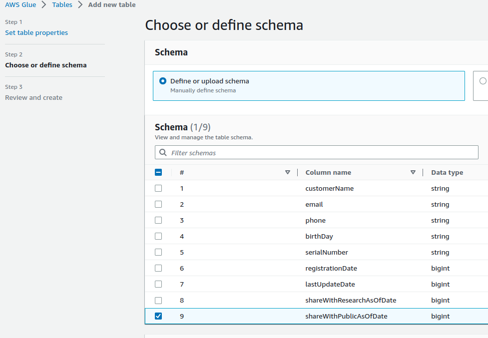
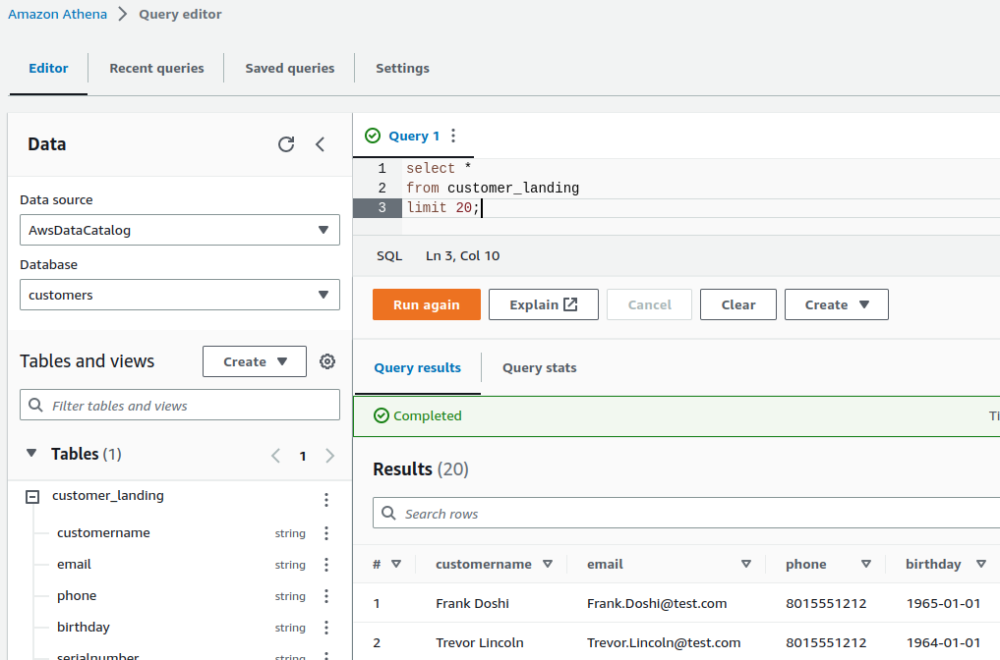
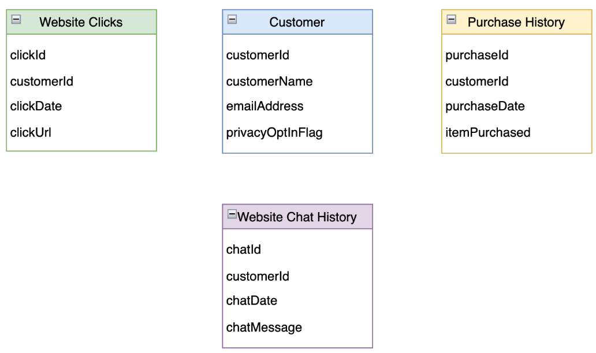
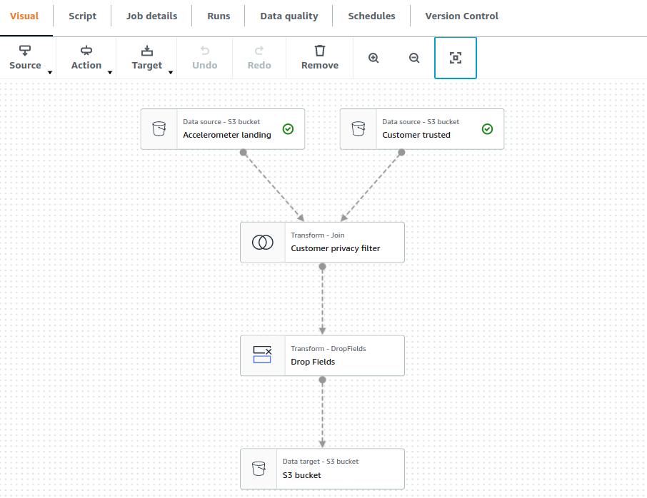

# Ingesting and organizing data in a Lakehouse

## Table of contents

1. [Define and query a landing zone table](#1-define-and-query-a-landing-zone-table).
    * [Use the Glue Console to define a table](#use-the-glue-console-to-define-a-table).
    * [AWS Athena: a Glue Catalog query tool](#aws-athena-a-glue-catalog-query-tool).
    * [Reverse engineer a table](#reverse-engineer-a-table).
2. [Ingest sensitive data](#2-ingest-sensitive-data).
3. [Athena joins with Glue Catalog](#3-athena-joins-with-glue-catalog).
    * [Data privacy in Data Lakes](#data-privacy-in-data-lakes).
    * [Joining multiple data sources](#join-accelerometer-with-customer-data).
    * [Join accelerometer with customer data](#join-accelerometer-with-customer-data).
4. [Spark Glue joins](#4-spark-glue-joins).


## 1. Define and query a landing zone table

**Context:** We are going to create an AWS Glue Catalog and table from data in an S3 bucket. After it is created, we will query the Glue Table with AWS Athena using SQL.

A [Glue Data Catalog](https://docs.aws.amazon.com/glue/latest/dg/components-overview.html) represents many sources and destinations for data. They can represent Kafka, Kinesis, Redshift, S3, and many more. If we want to connect to another data source, we must add it to the catalog. This makes querying data much easier.

A [Glue Table](https://docs.aws.amazon.com/glue/latest/dg/tables-described.html) is a definition of a specific group of fields that represents a logical entity. The Glue Catalog is made up of multiple table definitions. These tables are not physically stored in Glue. Glue tables are just a metadata catalog layer. They store a reference to the data we can query or store.

There are multiple ways to create Glue Tables. Here, we will focus on three ways to define a Glue Table in a Glue Catalog:
* Use the Glue Console to define each field.
* Configure a Glue Job to generate a table definition automatically.
* Use SQL to define a table with DDL (Data Definition Language) or create statements.


### Use the Glue Console to define a table

Following the example from the previous section, let's imagine we have the customer data in an S3 bucket directory, and we want to know how many records have been placed in the Customer Landing Zone. We can create a Glue Table definition to query the data using SQL.

* Look for **Data Catalog** in the AWS console.
* In the _Databases_ section, click **Add database**.
* Enter a name (_stedi_) and create the database.
* In the _Tables_ section, select **Add table**.
* Give a name (_customer\_landing_) and select the database we have created.
* Add the physical data store: enter the full path to the folder for your customer landing zone (_s3://dataeng-udacity-spark/customer/landing/_).
* Choose the data format (JSON) and click _Next_.
* **Define a schema:** using the sample record below, define the schema/fields in the Glue table, and click _Next_.

```json
{
"customerName":"Frank Doshi",
"email":"Frank.Doshi@test.com",
"phone":"8015551212",
"birthDay":"1965-01-01",
"serialNumber":"159a908a-371e-40c1-ba92-dcdea483a6a2",
"registrationDate":1655293787680,
"lastUpdateDate":1655293787680,
"shareWithResearchAsOfDate":1655293787680,
"shareWithPublicAsOfDate":1655293787680
}
```



* Review and click *Create* to confirm the table.


We create another table, called _customer\_trusted_, just modifying the pyshical data store (_s3://dataeng-udacity-spark/customer/trusted/_) that contains the data obtained when we run our [Spark job](./spark_aws.md#3-creating-a-spark-job-using-glue-studio).


### AWS Athena: a Glue Catalog query tool

Now that you we defined a table using the Glue Catalog, we might want to query the table. Previously we had to use Spark SQL and relied on Spark schemas to query data. Using the Glue Data Catalog, we can query data using an AWS tool called [Athena](https://aws.amazon.com/athena/?nc1=h_ls). The Athena tool is a serverless query service where you can write SQL to run ad-hoc queries on S3 buckets.

* Look for **Athena** in the AWS console.
* Click on **Query editor**.
* Athena uses S3 to store query results. Set up the location Athena will use from now going forward.
  * Click on _Edit settings_.
  * Select a location for the query result (_s3://dataeng-udacity-spark/athena/_) and save.
* **Editor**: run a simple query.
    ```sql
    select * 
    from customer_landing
    limit 20;
    ```
At this point, we may see some data that looks incorrect, such as a birth date of _1482-01-01_. Because it has not been scrubbed, invalid or unexpected data is often a feature of **landing zones**. We will later learn to remove invalid data from the fields before putting them in the trusted zone.




### Reverse engineer a table

Sometimes, it is helpful to pass on the schema definition. The easiest way to do it is through DDL (Data Definition Language) SQL statements. Now we you've generated a table in Glue, you can reverse engineer it, or generate the SQL statements.

In Athena, under tables section, click the three dots next to _customer_landing_, and click _Generate table DDL_.


## 2. Ingest sensitive data

Before we can process the sensitive accelerometer data, we need to bring it into the landing zone, as we did fot the customers data.

Using the AWS CLI, let's copy the accelerometer data into an S3 landing zone.

```bash
aws s3 cp ./project/starter/accelerometer/ s3://dataeng-udacity-spark/accelerometer/landing/ --recursive

# check the contents of the destination folder
aws s3 ls s3://dataeng-udacity-spark/accelerometer/landing/
```

**Handling sensitive data**  
Data in the landing zone should be dealt with very carefully. It shouldn't be made available for analytics or business intelligence.


**Define a Glue Table for the Accelerometer Landing Zone**
Now that we have some data in the landing zone we can define a Glue Table to make ad hoc querying easier. The landing zone should not be used for reporting or analytics, since the data is not qualified to be used for those purposes. However, we may want to get an idea of what the data looks like.

* For that purpose, we go to Athena's query editor, select the database, and create a new table from S3 bucket data.
* We follow the same steps as we did for creating the _customer\_landing_ table.
* We copy the table query and save it as [`accelerometer_landing.sql`](./scripts/accelerometer_landing.sql).

    ```sql
    CREATE EXTERNAL TABLE IF NOT EXISTS `accelerometer`.`accelerometer_landing` (
    `user` string,
    `timeStamp` bigint,
    `x` float,
    `y` float,
    `z` float
    )
    ROW FORMAT SERDE 'org.openx.data.jsonserde.JsonSerDe'
    WITH SERDEPROPERTIES (
    'ignore.malformed.json' = 'FALSE',
    'dots.in.keys' = 'FALSE',
    'case.insensitive' = 'TRUE',
    'mapping' = 'TRUE'
    )
    STORED AS INPUTFORMAT 'org.apache.hadoop.mapred.TextInputFormat' OUTPUTFORMAT 'org.apache.hadoop.hive.ql.io.HiveIgnoreKeyTextOutputFormat'
    LOCATION 's3://dataeng-udacity-spark/accelerometer/landing/'
    TBLPROPERTIES ('classification' = 'json');
    ```

* If we run a simple query, we see there is some Personally Identifiable Information (PII) in the data (field _user_).


## 3. Athena joins with Glue Catalog

### Data privacy in Data Lakes

Data lakes are a hazard for privacy enforcement. Data from many sources containing Personally Identifiable Information are brought in from various sources. These sources often have wide open access, without enforcing proper privacy constraints. This means the data in the landing zone should be dealt with very carefully.

Data in the landing zone should not be made available for data analysis without proper scrubbing. One way to filter data is based on opt-in flags on the customer record. If we are dealing with the customer record directly, and this is where that field is located, we are in good shape. Often the data we are dealing with are secondary to the customer record, such as website analytics, transaction history, or other events.




### Joining multiple data sources

As with most SQL databases, if you have two or more glue tables that share a common field (foreign key), you can join the two tables on the common field. The result is a composite of the fields from both records.

In the above example, joining the customer record with another table will create a composite of the fields from both tables. This allows us to determine if the given record is subject to privacy restrictions.

An inner join omits rows where there isn't a match between both tables. An inner join is the default type when joining two tables with SQL. This serves our use case perfectly.


### Join accelerometer with customer data

Using Glue we can do joins between multiple data sources. We can then add filters to include only those records where customers have opted to share their information. Let's practice using some accelerometer data.

NOTE: as with most SQL Databases, glue tables don't require strictly defined foreign keys


We need to identify which columns should be used for the join. As we can see, there are no fields with matching names. However, there are two fields with matching data (_email_ from _customer\_trusted_ and _user_ from _accelerometer\_landing_).

Use the Athena Query Editor to write a query joining both tables, and identify the fields with shareWithResearchAsOfDate not null.


## 4. Spark Glue joins

Now that we have the sensitive data in the **accelerometer landing zone**, we can write a glue job that filters the data and moves compliant records into an **accelerometer trusted zone** for later analysis. Let's go to Glue Studio, and create a new Glue Job, as we have [previously](./spark_aws.md#3-creating-a-spark-job-using-glue-studio) done.


### Configure the job

Job details:
* Name (*"Accelerometer Landing to Trusted"*).
* IAM Role.
* Job bookmark disabled.

We create two sources:
* accelerometer_landing (from S3 location).
* customer_trusted (from Data Catalog table).

Transform:
* Name: Customer privacy filter.
* Node type: join.
* Node parents: Accelerometer landing + Customer trusted.
* Add condition: user (Accelerometer landing) = email (Customer trusted).


Add another transform step:
* Type: drop fields.
* Parent: previous transform.
* Child should be the data target.
* Select to drop all the fields except: user, timestamp, x, y and z.
  
Data target:
* Parent: drop fields transformation.
* Format: JSON.
* S3 target location: _s3://dataeng-udacity-spark/accelerometer/trusted/_


Click on _Save_ and _Run_.





Once the job has run succesfully, we create a table called _accelerometer\_trusted_ in AWS Athena, and we check with a simple query that the data has been correctly loaded.


We have created a join that will automatically drop Accelerometer rows unless they can be joined to a customer record in the **Trusted Zone**.