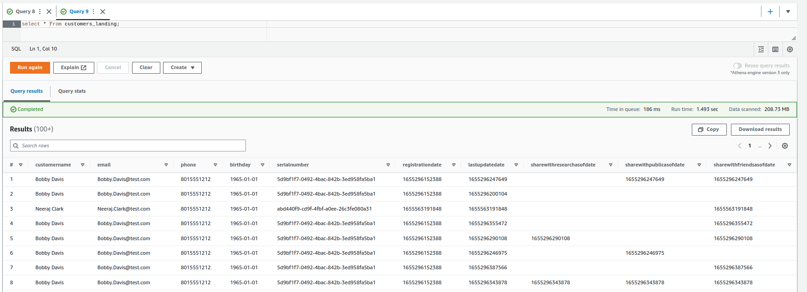
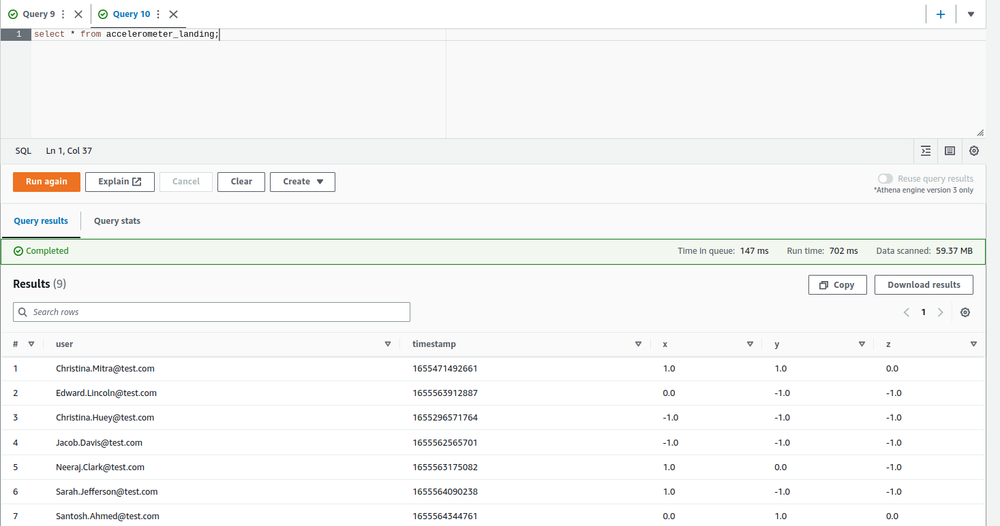
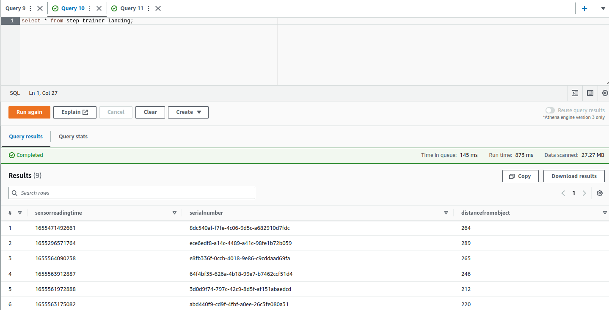
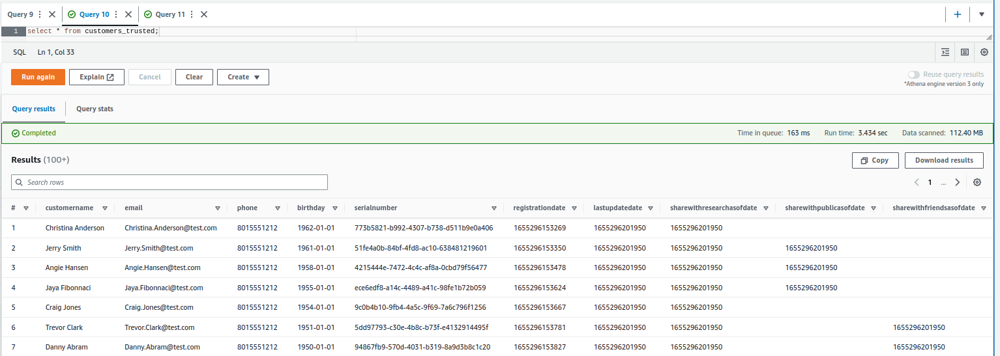

# Project: AWS Data Lakehouse

## Table of contents

*  [Introduction: STEDI Human Balance Analytics](#introduction-stedi-human-balance-analytics).
*  [Environment](#environment).
*  [Data sources](#data-sources).
   *  [Customer records](#customer-records).
   *  [Step Trainer records](#step-trainer-records).
   *  [Accelerometer records](#accelerometer-records).
*  [Project development](#project-development).
   *  [Data Lakehouse landing zone](#data-lakehouse-landing-zone).
   *  [Filter data based on customers agreements](#filter-data-based-on-customers-agreements).
   *  [Customers data quality issue](#customers-data-quality-issue).


## Introduction: STEDI Human Balance Analytics

The _STEDI Team_ has developed a new hardware called ***STEDI Step Trainer*** that:
* Trains the user to do a STEDI balance exercise.
* Has sensors on the device that collect data to train a machine-learning algorithm to detect steps.
* Has a companion mobile app that collects customer data and interacts with the device sensors.

The Step Trainer is just a motion sensor that records the distance of the object detected. The app uses a mobile phone accelerometer to detect motion in the X, Y, and Z directions.

The STEDI team wants to use the motion sensor data to train a machine learning model to detect steps accurately in real-time. Privacy will be a primary consideration in deciding what data can be used. Some of the early adopters have agreed to share their data for research purposes. Therefore, only these customers’ Step Trainer and accelerometer data should be used in the training data for the machine learning model.

As data engineers on the STEDI Step Trainer team, we will need to extract the data produced by the STEDI Step Trainer sensors and the mobile app, and curate them into a data lakehouse solution on AWS so that data scientists can train the learning model.


## Environment

For this project, we make use of the following tools:
* Python and Spark.
* AWS CLI.
* AWS S3.
* AWS Glue.
* AWS Athena.


## Data sources

STEDI has three data sources composed of JSON files to use from the Step Trainer.


### Customer records

From fulfillment and the STEDI website.  
AWS S3 Bucket URI: `s3://cd0030bucket/customers/`.  
It contains the following fields:

```
customerName
email
phone
birthDay
serialNumber
registrationDate
lastUpdateDate
shareWithResearchAsOfDate
shareWithPublicAsOfDate
shareWithFriendsAsOfDate
```


### Step Trainer records

Data from the motion sensor.  
AWS S3 Bucket URI: `s3://cd0030bucket/step_trainer/`.  
It contains the following fields:

```
sensorReadingTime
serialNumber
distanceFromObject
```


### Accelerometer records

Data from the mobile app.  
AWS S3 Bucket URI: `s3://cd0030bucket/accelerometer/`.  
It contains the following fields:

```
user
timeStamp
x
y
z
```


## Project development

### Initial setup

#### Configure the S3 VPC Gateway Endpoint

First of all, we create an S3 bucket (***dataeng-udacity***) using the AWS CLI.

```bash
aws s3 mb s3://dataeng-udacity
```

Since the S3 Service runs in a different network than AWS Glue, we need to create an S3 Gateway Endpoint to allow S3 traffic from our Glue Jobs into our S3 bucket.

We run the following commands to get the values for the _VpcId_ and _RouteTableId_ fields, and then use them to create an S3 Gateway Endpoint.

```bash
# find VpcId value
aws ec2 describe-vpcs

# find RouteTableId value
aws ec2 describe-route-tables

# create S3 Gateway Endpoint
aws ec2 create-vpc-endpoint \
    --vpc-id <VpcId> \
    --service-name com.amazonaws.us-east-1.s3 \
    --route-table-ids <RouteTableId>
```

#### Create a Glue service IAM role

For AWS Glue to act on our behalf to access S3 and other resources, we need to grant access to the Glue Service by creating an IAM Service Role that can be assumed by Glue.

```bash
aws iam create-role --role-name my-lakehouse-project-role --assume-role-policy-document '{
    "Version": "2012-10-17",
    "Statement": [
        {
            "Effect": "Allow",
            "Principal": {
                "Service": "glue.amazonaws.com"
            },
            "Action": "sts:AssumeRole"
        }
    ]
}'
```

Then, we have to grant Glue privileges on the S3 bucket, to allow our Glue job to read/write/delete **access to the buckets (both source and detination)** and everything in it. To do that, we must indicate the AWS Resource Name (ARN) of the bucket with the source data and ours.


```bash
aws iam put-role-policy --role-name my-lakehouse-project-role --policy-name S3Access --policy-document '{
    "Version": "2012-10-17",
    "Statement": [
        {
            "Effect": "Allow",
            "Action": [
                "s3:GetBucketLocation",
                "s3:ListBucket",
                "s3:GetObject",
                "s3:GetObjectTagging"
            ],
            "Resource": [
                "arn:aws:s3:::cd0030bucket",
                "arn:aws:s3:::cd0030bucket/*"
                
            ]
        },
        {
            "Effect": "Allow",
            "Action": [
                "s3:GetBucketLocation",
                "s3:ListBucket",
                "s3:GetObject",
                "s3:PutObject",
                "s3:deleteObject",
                "s3:GetObjectTagging",
                "s3:PutObjectTagging"
            ],
            "Resource": [
                "arn:aws:s3:::dataeng-udacity",
                "arn:aws:s3:::dataeng-udacity/*"
            ]
        }
    ]
}'
```

To finish with the IAM role setup, we give Glue access to data in special S3 buckets used for Glue configuration, and several other resources.

```bash
aws iam put-role-policy --role-name my-lakehouse-project-role --policy-name GlueAccess --policy-document '{
    "Version": "2012-10-17",
    "Statement": [
        {
            "Effect": "Allow",
            "Action": [
                "glue:*",
                "s3:GetBucketLocation",
                "s3:ListBucket",
                "s3:ListAllMyBuckets",
                "s3:GetBucketAcl",
                "ec2:DescribeVpcEndpoints",
                "ec2:DescribeRouteTables",
                "ec2:CreateNetworkInterface",
                "ec2:DeleteNetworkInterface",
                "ec2:DescribeNetworkInterfaces",
                "ec2:DescribeSecurityGroups",
                "ec2:DescribeSubnets",
                "ec2:DescribeVpcAttribute",
                "iam:ListRolePolicies",
                "iam:GetRole",
                "iam:GetRolePolicy",
                "cloudwatch:PutMetricData"
            ],
            "Resource": [
                "*"
            ]
        },
        {
            "Effect": "Allow",
            "Action": [
                "s3:CreateBucket",
                "s3:PutBucketPublicAccessBlock"
            ],
            "Resource": [
                "arn:aws:s3:::aws-glue-*"
            ]
        },
        {
            "Effect": "Allow",
            "Action": [
                "s3:GetObject",
                "s3:PutObject",
                "s3:DeleteObject"
            ],
            "Resource": [
                "arn:aws:s3:::aws-glue-*/*",
                "arn:aws:s3:::*/*aws-glue-*/*"
            ]
        },
        {
            "Effect": "Allow",
            "Action": [
                "s3:GetObject"
            ],
            "Resource": [
                "arn:aws:s3:::crawler-public*",
                "arn:aws:s3:::aws-glue-*"
            ]
        },
        {
            "Effect": "Allow",
            "Action": [
                "logs:CreateLogGroup",
                "logs:CreateLogStream",
                "logs:PutLogEvents",
                "logs:AssociateKmsKey"
            ],
            "Resource": [
                "arn:aws:logs:*:*:/aws-glue/*"
            ]
        },
        {
            "Effect": "Allow",
            "Action": [
                "ec2:CreateTags",
                "ec2:DeleteTags"
            ],
            "Condition": {
                "ForAllValues:StringEquals": {
                    "aws:TagKeys": [
                        "aws-glue-service-resource"
                    ]
                }
            },
            "Resource": [
                "arn:aws:ec2:*:*:network-interface/*",
                "arn:aws:ec2:*:*:security-group/*",
                "arn:aws:ec2:*:*:instance/*"
            ]
        }
    ]
}'
```


### Data Lakehouse landing zone

As a starting point, we copy the data from the 3 sources into our S3 bucket.

```bash
aws s3 cp s3://cd0030bucket/customers/ s3://dataeng-udacity/customers/landing/ --recursive
aws s3 cp s3://cd0030bucket/step_trainer/ s3://dataeng-udacity/step_trainer/landing/ --recursive
aws s3 cp s3://cd0030bucket/accelerometer/ s3://dataeng-udacity/accelerometer/landing/ --recursive
```

In order to get an overview of the source data, we create a database (_stedi_) and we add three Glue tables, one for each landing zone. Then, we use Athena to query the tables. 

* _customers\_landing_: [SQL DDL script](./scripts/customers_landing.sql).

    

* _accelerometer\_landing_: [SQL DDL script](./scripts/accelerometer_landing.sql).

    

* _step\_trainer\_landing_: [SQL DDL script](./scripts/step_trainer_landing.sql).

    


### Filter data based on customers agreements

At this point, we create 2 AWS Glue jobs to only keep in our Lakehouse trusted zone the records from customers who agreed to share their data for research purposes.

**Customers trusted data**
* We build the [customers\_landing\_to\_trusted.py](./scripts/customers_landing_to_trusted.py) job by using Glue Studio.
* We create a Glue table (_customers\_trusted_) and query it to confirm that we only have records from customers who agreed to share their data_: [SQL DDL script](./scripts/customers_trusted.sql).

    


**Accelerometer trusted data**
* We build the [accelerometer\_landing\_to\_trusted.py](./scripts/accelerometer_landing_to_trusted.py) job, where we join data (on the _email_ field) from two sources located in our S3 bucket:
  * _accelerometer\_landing_.
  * _customers\_trusted_.
* In our job, from the joined data, we add an SQL query tansformation to filter out any records that were prior to the research consent date.


### Customers data quality issue

The serial number should be a unique identifier for the STEDI Step Trainer they purchased. However, there was a defect in the fulfillment website, and it used the same 30 serial numbers over and over again for millions of customers. Most customers have not received their Step Trainers yet, but those who have, are submitting Step Trainer data over the IoT network (landing zone). The data from the Step Trainer Records has the correct serial numbers. The problem is that because of this serial number bug in the fulfillment data (landing zone), we don’t know which customer the Step Trainer Records data belongs to.

**Customers curated data**  
* First, we create the [customers\_trusted\_to\_curated.py](./scripts/customers_trusted_to_curated.py) Glue job to sanitize the customer data from the trusted zone and save the output, which only includes customers who have accelerometer data and have agreed to share their data for research, in the curated zone.
  * This job makes an inner join between the customer trusted table and the accelerometer trusted table.
* We build and query a Glue table called _customers\_curated_: [SQL DDL script](./scripts/customers_curated.sql).


**Step trainer trusted data**  
We need to read the Step Trainer IoT data stream (landing zone) and populate a trusted zone Glue Table called _step\_trainer\_trusted_ that contains the Step Trainer records data for customers who have accelerometer data and have agreed to share their data for research (_customers\_curated_).
* We run the [step\_trainer\_landing\_to\_trusted.py](./scripts/step_trainer_landing_to_trusted.py) job that joins landing step trainer data and curated customers data.
* We build and query a Glue table called _step\_trainer\_trusted_: [SQL DDL script](./scripts/step_trainer_trusted.sql).


**Machine learning curated data**  
Finally, we create an aggregated table that has each of the Step Trainer readings, and the associated accelerometer reading data for the same timestamp, but only for customers who have agreed to share their data, and make a glue table called machine_learning_curated.
* We create the [machine\_learning\_curated.py](./scripts/machine_learning_curated.py) job that joins step trainer and accelerometer data both from the trusted zone. We make a left join to keep all the step trainer records.
* In order to have anonymized data, we drop the _user_ field after joining the tables, and we run the job.
* We build and query a Glue table called _machine\_learning\_curated_: [SQL DDL script](./scripts/machine_learning_curated.sql).