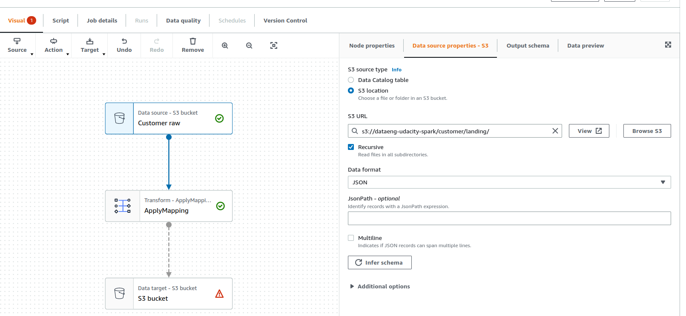
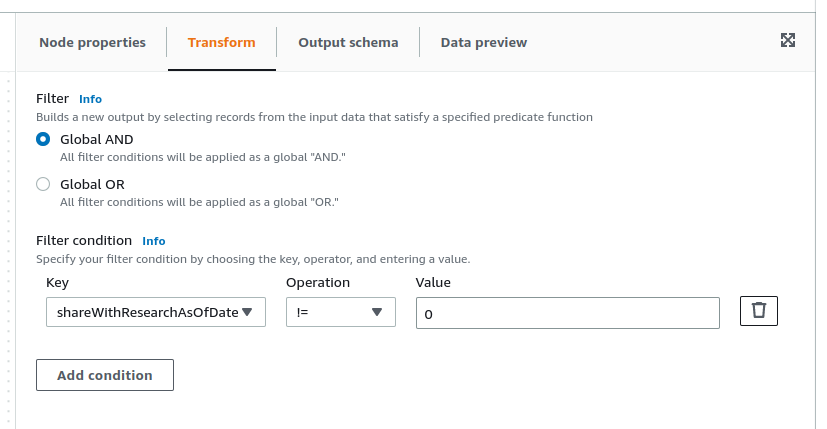
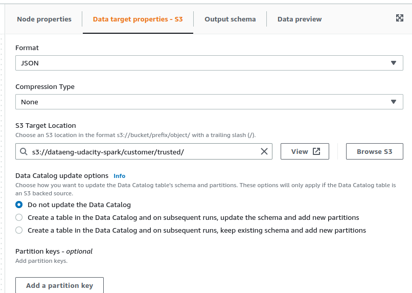

# Using Spark in AWS


## Table of contents

1. [Configuring the S3 VPC Gateway Endpoint](#1-configuring-the-s3-vpc-gateway-endpoint).
2. [Creating the Glue Service IAM role](#2-creating-the-glue-service-iam-role).
3. [Creating a Spark job using Glue Studio](#3-creating-a-spark-job-using-glue-studio).


## 1. Configuring the S3 VPC Gateway Endpoint

We use the **AWS Cloud Shell** from the AWS console, which opens a terminal that comes with AWS CLI preinstalled.

**Step 1. Create an S3 Bucket**  

Buckets are storage locations within AWS, that have a hierarchical directory-like structure.

```bash
# create an S3 bucket
aws s3 mb s3://dataeng-udacity-spark

# list objects in the bucket (empty so far)
aws s3 ls s3://dataeng-udacity-spark
```

**Step 2. S3 Gateway Endpoint**  

By default, Glue Jobs can't reach any networks outside of your Virtual Private Cloud (VPC). Since the S3 Service runs in a different network, we need to create what's called an S3 Gateway Endpoint. This allows S3 traffic from your Glue Jobs into your S3 buckets. Once we have created the endpoint, your Glue Jobs will have a network path to reach S3.

First we run the following command to **identify the VPC** that needs access to S3:

```bash
aws ec2 describe-vpcs
```

The output should look something like this (we are interested in the `VpcId` field):

```json
{
    "Vpcs": [
        {
            "CidrBlock": "172.31.0.0/16",
            "DhcpOptionsId": "dopt-756f580c",
            "State": "available",
            "VpcId": "vpc-7385c60b",
            "OwnerId": "863507759259",
            "InstanceTenancy": "default",
            "CidrBlockAssociationSet": [
                {
                    "AssociationId": "vpc-cidr-assoc-664c0c0c",
                    "CidrBlock": "172.31.0.0/16",
                    "CidrBlockState": {
                        "State": "associated"
                    }
                }
            ],
            "IsDefault": true
        }
    ]
}
```

Next, we need to **identify the routing table** we want to configure with our VPC Gateway. We will most likely only have a single routing table if we are using the default workspace. 

```bash
aws ec2 describe-route-tables
```

From the otuput, we are interested in the `RouteTableId` field.

```json
{
    "RouteTables": [

        {
      . . .
            "PropagatingVgws": [],
            "RouteTableId": "rtb-bc5aabc1",
            "Routes": [
                {
                    "DestinationCidrBlock": "172.31.0.0/16",
                    "GatewayId": "local",
                    "Origin": "CreateRouteTable",
                    "State": "active"
                }
            ],
            "Tags": [],
            "VpcId": "vpc-7385c60b",
            "OwnerId": "863507759259"
        }
    ]
}
```

Finally, we can **create an S3 Gateway Endpoint** using the values we have got for VPC and routing table IDs.

```bash
aws ec2 create-vpc-endpoint \
    --vpc-id <VpcId> \
    --service-name com.amazonaws.us-east-1.s3 \
    --route-table-ids <RouteTableId>
```


## 2. Creating the Glue Service IAM role

AWS uses Identity and Access Management (IAM) service to manage users and roles (which can be reused by users and services). A Service Role in IAM is a Role that is used by an AWS Service to interact with cloud resources.

For AWS Glue to act on our behalf to access S3 and other resources, we need to grant access to the Glue Service by creating an IAM Service Role that can be assumed by Glue.

```bash
aws iam create-role --role-name my-glue-service-role --assume-role-policy-document '{
    "Version": "2012-10-17",
    "Statement": [
        {
            "Effect": "Allow",
            "Principal": {
                "Service": "glue.amazonaws.com"
            },
            "Action": "sts:AssumeRole"
        }
    ]
}'
```

Then, we have to grant Glue privileges on the S3 bucket, to allow our Glue job read/write/delete access to the bucket and everything in it. To do that, we have to indicate the AWS Resource Name (ARN) of our S3 bucket.


```bash
aws iam put-role-policy --role-name my-glue-service-role --policy-name S3Access --policy-document '{
    "Version": "2012-10-17",
    "Statement": [
        {
            "Sid": "ListObjectsInBucket",
            "Effect": "Allow",
            "Action": [
                "s3:ListBucket"
            ],
            "Resource": [
                "arn:aws:s3:::dataeng-udacity-spark"
            ]
        },
        {
            "Sid": "AllObjectActions",
            "Effect": "Allow",
            "Action": "s3:*Object",
            "Resource": [
                "arn:aws:s3:::dataeng-udacity-spark/*"
            ]
        }
    ]
}'
```

**NOTE:** The format of an ARN is generally `arn:[aws/aws-cn/aws-us-gov]:[service]:[region]:[account-id]:[resource-id]`.  

Last, we need to give Glue access to data in special S3 buckets used for Glue configuration, and several other resources. Use the following policy for general access needed by Glue:

```bash
aws iam put-role-policy --role-name my-glue-service-role --policy-name GlueAccess --policy-document '{
    "Version": "2012-10-17",
    "Statement": [
        {
            "Effect": "Allow",
            "Action": [
                "glue:*",
                "s3:GetBucketLocation",
                "s3:ListBucket",
                "s3:ListAllMyBuckets",
                "s3:GetBucketAcl",
                "ec2:DescribeVpcEndpoints",
                "ec2:DescribeRouteTables",
                "ec2:CreateNetworkInterface",
                "ec2:DeleteNetworkInterface",
                "ec2:DescribeNetworkInterfaces",
                "ec2:DescribeSecurityGroups",
                "ec2:DescribeSubnets",
                "ec2:DescribeVpcAttribute",
                "iam:ListRolePolicies",
                "iam:GetRole",
                "iam:GetRolePolicy",
                "cloudwatch:PutMetricData"
            ],
            "Resource": [
                "*"
            ]
        },
        {
            "Effect": "Allow",
            "Action": [
                "s3:CreateBucket",
                "s3:PutBucketPublicAccessBlock"
            ],
            "Resource": [
                "arn:aws:s3:::aws-glue-*"
            ]
        },
        {
            "Effect": "Allow",
            "Action": [
                "s3:GetObject",
                "s3:PutObject",
                "s3:DeleteObject"
            ],
            "Resource": [
                "arn:aws:s3:::aws-glue-*/*",
                "arn:aws:s3:::*/*aws-glue-*/*"
            ]
        },
        {
            "Effect": "Allow",
            "Action": [
                "s3:GetObject"
            ],
            "Resource": [
                "arn:aws:s3:::crawler-public*",
                "arn:aws:s3:::aws-glue-*"
            ]
        },
        {
            "Effect": "Allow",
            "Action": [
                "logs:CreateLogGroup",
                "logs:CreateLogStream",
                "logs:PutLogEvents",
                "logs:AssociateKmsKey"
            ],
            "Resource": [
                "arn:aws:logs:*:*:/aws-glue/*"
            ]
        },
        {
            "Effect": "Allow",
            "Action": [
                "ec2:CreateTags",
                "ec2:DeleteTags"
            ],
            "Condition": {
                "ForAllValues:StringEquals": {
                    "aws:TagKeys": [
                        "aws-glue-service-resource"
                    ]
                }
            },
            "Resource": [
                "arn:aws:ec2:*:*:network-interface/*",
                "arn:aws:ec2:*:*:security-group/*",
                "arn:aws:ec2:*:*:instance/*"
            ]
        }
    ]
}'
```


## 3. Creating a Spark job using Glue Studio

Glue Studio is a Graphical User Interface (GUI) for interacting with Glue to create Spark jobs with added capabilities. Glue APIs give access to things like Glue Tables, and Glue Context. These APIs are designed to enhance our Spark experience by simplifying development.

We can create Glue Jobs by writing, and uploading python code, but Glue Studio also provides a drag and drop experience. When we create a flow diagram using Glue Studio, it generates the Python or Scala Code for us automatically. The code is stored with additional configuration for running in Spark, including third-party libraries, job parameters, and the AWS IAM Role Glue uses.

### Extract and load customer data

Let's assume a website creates a daily JSON file of all new customers created during the previous 24 hours. That JSON file will go into the S3 **landing zone** designated for new data. A landing zone is a place where new data arrives prior to processing.

We can copy a sample customer file into S3 using the the AWS CLI.

```bash
# clone repo to get sample file
git clone https://github.com/udacity/nd027-Data-Engineering-Data-Lakes-AWS-Exercises.git

# inside nd027[...] directory
# copy the file into our S3 bucket
aws s3 cp ./project/starter/customer/customer-keep-1655293787679.json s3://dataeng-udacity-spark/customer/landing/

# check the contents of our bucket
aws s3 ls s3://dataeng-udacity-spark/customer/landing/
```


### Glue Studio Visual Editor

The Glue Studio Visual Editor allows us to select three types of nodes when creating a pipeline:
* Source- the data that will be consumed in the pipeline.
  * A common source is an S3 location or a Glue Table. But a source can be any AWS Database.
* Transform - any transformation that will be applied.
  * Common transformations include Joins, Field Mapping, and Filter. 
  * Custom SQL statements are also supported.
* Target - the destination for the data.
  * All of the source types are also supported as targets.


### Create a Spark Job with Glue Studio

To use Glue Studio, search for it in the AWS Console. Then click the **AWS Glue Studio** menu option.

Select **Jobs** from the Glue Studio Menu on the left side.

To get started, go with the default selection: **Visual with a source and target**, and click *Create*.


### Privacy filter

One of the most important transformations is excluding Personally Identifiable Information (PII). Glue has an out-of-the-box filter, but we are going to make our own. For the **Data source** in your Glue Studio Job, choose the S3 bucket you created earlier, with the folder containing the *raw* or *landing* customer data. The folder should have a forward-slash / on the end: `s3://dataeng-udacity-spark/customer/landing/`. Choose the *data format* (JSON in our case), and click on *Infer schema*.

Under Node properties, name the Data source appropriately, for example: *"Customer raw"*.




For the **transformation**, change the name (e.g., *"Privacy filter"*) and select *Filter* in the *Node type* option.

Filter on the *shareWithResearchAsOfDate* timestamp field, and configure it to eliminate any customers that have a non-zero *shareWithResearchAsOfDate*.



For your **destination**, change the name (e.g., "Trusted customer zone"), and choose an S3 location for customers who have chosen to share with research, or a trusted zone. The S3 bucket should be the bucket you created earlier. Any time you specify a folder that doesn't exist, S3 will automatically create it the first time data is placed there. Be sure to add the forward-slash on the end of the folder path: `s3://dataeng-udacity-spark/customer/trusted/`.



### Save and run the job

Under **Job Details** create a *Name* for the Job (*"Customer Landing to Trusted"*), and choose the *IAM Role* that the job will use during execution. This should be the Glue Service Role you created earlier.

Make sure *Job bookmark* option is disabled.

In *Advanced properties*, change the script filename to **customer_landing_to_trusted.py**.

Click the *Save* button, then click *Run*.

On the green ribbon, click the **Run Details** link.

You will then see the run details. By default the job will run three times before quitting. To view the logs, click the *Error Logs* link. This includes all of the non-error logs as well.

To see the logs in real-time, click the *log stream id*.

If the log viewer stops, click the *Resume* button. It often pauses if the output takes more than a couple of seconds to progress to the next step. Notice that most of the output in this example is INFO. If you see a row marked as ERROR, you can expand that row to determine the error.


### View the generated script

To view the generated script, go back to Glue Studio, and click the **Script** tab.

Download the script, and save it in your VS Code Workspace as [`customer_landing_to_trusted.py`](./scripts/customer_landing_to_trusted.py).


**Analyzing the Glue code**  

If we take a look at the script we generated, we notice that, in addition to a SparkContext, we have a concept called a GlueContext. We are also using something called Dynamic Frames. Dynamic Frames are very similar to DataFrames, with the added capabilities of Glue APIs we mentioned earlier, such as sources, transformations, and destinations. DataFrames can be converted to Dynamic Frames and vice versa.


