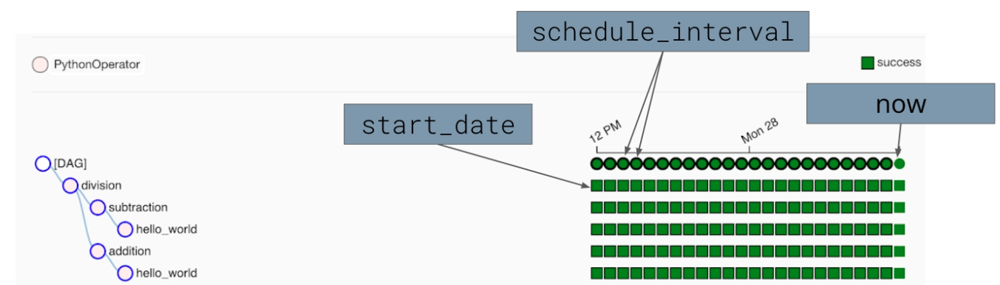

# Data Quality

## Table of contents

* [Data lineage](#data-lineage).
* [Scheduling in Airflow](#scheduling-in-airflow).
* [Data partitioning](#data-partitioning).
* [Data quality](#data-quality-1).


## Data lineage

In Airflow, task dependencies can be used to reflect and track data lineage.

```python
create_table >> load_from_s3_to_redshift >> calculate_location_traffic
```

The graph view of a DAG can let us see the success or failures of individual tasks.


## Scheduling in Airflow

Schedules used by data pipelines determine what data should be analyzed and when.

Airflow will **catchup** by creating a DAG run for every period defined by the `schedule_interval` between the `start_date` and now.




### Catchup

Airflow uses the schedule interval to create historical DAG runs and catchup (backfill) data.

Whenever the start date of a DAG is in the past, and the time difference between the start date and now includes more than one schedule intervals, Airflow will automatically schedule and execute a DAG run to satisfy each one of those intervals. Catchup is enabled by default. See the sample code below to disable `catchup` at a DAG level.


### Start date

Airflow will begin running pipelines on the date in the `start_date` parameter . This is the date when a scheduled DAG will start executing on its own. In the sample code below, the DAG will be scheduled to run daily beginning immediately.


```python
@dag(
    # schedule to run daily
    # once it is enabled in Airflow
    schedule_interval='@daily',
    start_date=pendulum.now(),
    catchup=False
)
```


### End date

Airflow pipelines can optionally have end dates. You can use an `end_date` parameter to let Airflow know the date it should stop running a scheduled pipeline. End_dates can also be useful when you want to perform an overhaul or redesign of an existing pipeline. Update the old pipeline with an end_date and then have the new pipeline start on the end date of the old pipeline.

In the sample code below, the DAG will be scheduled to run daily, beginning August 1st 2022, and end running September 1st 2022.

```python
@dag(
    start_date=pendulum.datetime(2022, 8, 1, 0, 0, 0, 0),
    end_date=pendulum.datetime(2022, 9, 1, 0, 0, 0, 0),
    schedule_interval='@daily',
    max_active_runs=1    
)
```


## Data partitioning

**S3 partition strategies**  

In the exercises demonstration we upgrade our demonstration DAG to work on logically partitioned data. The data that we use in this lesson has been pre-partitioned in Amazon Web Services (AWS) S3 by creation date. The partition follows the format: `<year>/<month>/<day>/<file>.csv`.

In practice, it is often best to have Airflow process pre-partitioned data. If your upstream data sources cannot partition data, it is possible to write an Airflow DAG to partition the data. However, it is worth keeping in mind memory limitations on your Airflow workers. If the size of the data to be partitioned exceeds the amount of memory available on your worker, the DAG will not successfully execute.


## Data quality

Data quality is the measure of how well a dataset satisfies its intended use.

Adherence to a set of **requirements** is a good starting point for measuring data quality.
Requirements should be defined by you and your data consumers before you start creating your data pipeline.

Examples of quality requirements:
* Data must be a certain size.
* Data must be accurate to some margin of error.
* Data must arrive within a given timeframe from the start of execution.
* Pipelines must run on a particular schedule.
* Data must not contain any sensitive information.
