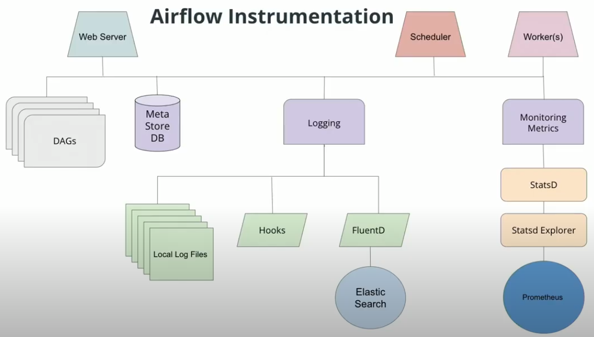

# Production Data Pipelines

## Table of contents

* [Extending Airflow with Plugins](#extending-airflow-with-plugins).
* [Best Practices for Data Pipeline Steps - Task Boundaries](#best-practices-for-data-pipeline-steps---task-boundaries).
* [Converting Airflow 1 DAG into Airflow 2 Format](#converting-airflow-1-dag-into-airflow-2-format).
* [Pipeline Monitoring](#pipeline-monitoring).
* [Additional resources: list of pipeline orchestrators](#additional-resources-list-of-pipeline-orchestrators).


## Extending Airflow with Plugins

Airflow was built with the intention of allowing its users to extend and customize its functionality through plugins. The most common types of user-created plugins for Airflow are **Operators** and **Hooks**. These plugins make DAGs reusable and simpler to maintain.

Custom operators are typically used to capture frequently used operations into a reusable form.

Check [Airflow contrib](https://github.com/apache/airflow/tree/main/airflow/contrib) and [Airflow providers](https://github.com/apache/airflow/tree/main/airflow/providers) before building your own Airflow plugins to see if what you need already exists.

To create custom operator, follow the steps:
1. Identify Operators that perform similar functions and can be consolidated.
2. Define a new Operator in the plugins folder.
3. Replace the original Operators with your new custom one, re-parameterize, and instantiate them.

[Here](https://airflow.apache.org/docs/apache-airflow/stable/howto/custom-operator.html) is the Official Airflow Documentation for custom operators.


## Best Practices for Data Pipeline Steps - Task Boundaries

DAG tasks should be designed such that they are:
* Atomic and have a single purpose.
* Maximize parallelism.
* Make failure states obvious.

Every task in your dag should perform **only one job**.

**Benefits of Task boundaries**
* Re-visitable: Task boundaries are useful for you if you revisit a pipeline you wrote after a 6 month absence. You'll have a much easier time understanding how it works and the lineage of the data if the boundaries between tasks are clear and well defined. This is true in the code itself, and within the Airflow UI.
* Tasks that do just one thing are often more easily parallelized. This parallelization can offer a significant speedup in the execution of our DAGs.


## Converting Airflow 1 DAG into Airflow 2 Format

Key Differences:
* Airflow1 instantiates the DAG directly with `dag= DAG (...)` whereas, with Airflow2, you'll use a decorator.
* Airflow1 uses explicitly stated DAG names, but Airflow2 can infer DAG names from functions.
* Airflow1 uses `PythonOperator()` in tasks, but in Airflow2, you'll use a regular Python function with the task decorator.
* In Airflow2, you don't instantiate the DAG, so you don't have to pass the DAG.


Airflow 1 DAG:

```python
dag = DAG(
    'data_quality_legacy',
    start_date=pendulum.datetime(2018, 1, 1, 0, 0, 0, 0),
    end_date=pendulum.datetime(2018, 12, 1, 0, 0, 0, 0),
    schedule_interval='@monthly',
    max_active_runs=1
)

def load_trip_data_to_redshift(*args,* *kwargs):
    metastoreBackend = MetastoreBackend()
    aws_connection=metastoreBackend.get_connection("aws_credentials")
    redshift_hook = PostgresHook("redshift")
    execution_date = kwargs["execution_date"]
    sql_stmt = sql_statements.COPY_MONTHLY_TRIPS_SQL.format(
        aws_connection.login,
        aws_connection.password,
        year=execution_date.year,
        month=execution_date.month
    )
    redshift_hook.run(sql_stmt)

load_trips_task = PythonOperator(
    task_id='load_trips_from_s3_to_redshift',
    dag=dag,
    python_callable=load_trip_data_to_redshift,
    provide_context=True,
    sla=datetime.timedelta(hours=1)
)

. . .

create_trips_table >> load_trips_task
```


Airflow 2 DAG:

```python
@dag(
    start_date=pendulum.datetime(2018, 1, 1, 0, 0, 0, 0),
    end_date=pendulum.datetime(2018, 12, 1, 0, 0, 0, 0),
    schedule_interval='@monthly',
    max_active_runs=1    
)
def data_quality():

    @task(sla=datetime.timedelta(hours=1))
    def load_trip_data_to_redshift(*args,* *kwargs):
        metastoreBackend = MetastoreBackend()
        aws_connection=metastoreBackend.get_connection("aws_credentials")
        redshift_hook = PostgresHook("redshift")
        execution_date = kwargs["execution_date"]
        sql_stmt = sql_statements.COPY_MONTHLY_TRIPS_SQL.format(
            aws_connection.login,
            aws_connection.password,
            year=execution_date.year,
            month=execution_date.month
        )
        redshift_hook.run(sql_stmt)

    load_trips_task = load_trip_data_to_redshift()
    
. . .

create_trips_table >> load_trips_task
```


## Pipeline Monitoring

Airflow can surface metrics and emails to help you stay on top of pipeline issues.

**SLAs**  
Airflow DAGs may optionally specify an SLA, or “Service Level Agreement”, which is defined as a time by which a DAG must complete. For time-sensitive applications these features are critical for developing trust amongst your pipeline customers and ensuring that data is delivered while it is still meaningful. Slipping SLAs can also be early indicators of performance problems, or a need to scale up the size of your Airflow cluster.


**Emails and alerts**  
Airflow can be configured to send emails on DAG and task state changes. These state changes may include successes, failures, or retries. Failure emails can allow you to easily trigger alerts. It is common for alerting systems like PagerDuty to accept emails as a source of alerts. If a mission-critical data pipeline fails, you will need to know as soon as possible to get online and get it fixed.


**Metrics**
Airflow comes out of the box with the ability to send system metrics using a metrics aggregator called [StatsD](https://airflow.apache.org/docs/apache-airflow/2.5.1/administration-and-deployment/logging-monitoring/metrics.html). StatsD can be coupled with metrics visualization tools like [Grafana](https://grafana.com/) and monitoring tools like [Prometheus](https://prometheus.io/) to provide you and your team high level insights into the overall performance of your DAGs, jobs, and tasks. These systems can be integrated into your alerting system, such as pagerduty, so that you can ensure problems are dealt with immediately. These Airflow system-level metrics allow you and your team to stay ahead of issues before they even occur by watching long-term trends.


**Logging**  
By default, Airflow logs to the local file system. You probably sifted through logs so far to see what was going on with the scheduler. Logs can be forwarded using standard logging tools like [fluentd](https://www.fluentd.org/).

See Airflow logging and monitoring architecture [here](https://airflow.apache.org/docs/apache-airflow/stable/administration-and-deployment/logging-monitoring/logging-architecture.html).





## Additional resources: list of pipeline orchestrators

[Awesome Pipeline](https://github.com/pditommaso/awesome-pipeline).