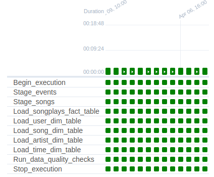

# Project: Data Pipelines with Airflow

## Table of contents

* [Introduction](#introduction).
* [Prerequisites](#prerequisites).
* [Data sources](#data-sources).
* [Project structure](#project-structure).
* [Create tables DAG](#create-tables-dag)
* [Configuring the main DAG](#configuring-the-main-dag).
* [Building the operators](#building-the-operators).
* [Running the main DAG](#running-the-main-dag)


## Introduction

A music streaming company, Sparkify, has decided that it is time to introduce more automation and monitoring to their data warehouse ETL pipelines and come to the conclusion that the best tool to achieve this is Apache Airflow.

They have decided to bring us into the project and expect us to create high grade data pipelines that are dynamic and built from reusable tasks, can be monitored, and allow easy backfills. They have also noted that the data quality plays a big part when analyses are executed on top the data warehouse and want to run tests against their datasets after the ETL steps have been executed to catch any discrepancies in the datasets.

The source data resides in S3 and needs to be processed in Sparkify's data warehouse in Amazon Redshift. The source datasets consist of JSON logs that tell about user activity in the application and JSON metadata about the songs the users listen to.


## Prerequisites

* [Create an IAM user in AWS](../airflow/dags/l3_airflow_and_aws/README.md#create-an-iam-user-in-aws).
* [Configure Redshift Serverless in AWS](../airflow/dags/l3_airflow_and_aws/README.md#configure-aws-redshift-serverless).
* [Connect Airflow and AWS](../airflow/dags/l3_airflow_and_aws/README.md#add-airflow-connections).
* [Connect Airflow to AWS Redshift Serverless](../airflow/dags/l3_airflow_and_aws/README.md#add-airflow-connections-to-aws-redshift).


## Data sources

For this project, we work with two datasets. Here are the s3 links for each:
* Log data: `s3://udacity-dend/log_data`.
* Song data: `s3://udacity-dend/song_data`.

There is also a third file, `s3://udacity-dend/log_json_path.json`, which contains the meta information that is required by AWS to correctly load the log dataset.

We need to copy the data to our own bucket, so Redhsift can have access to it.

If we haven't already, we create our own bucket using the AWS Cloudshell (buckets need to be unique across all AWS accounts):

```bash
aws s3 mb s3://airflow-aws/
```

Copy the data from the Udacity bucket to the home cloudshell directory: 

```bash
aws s3 cp s3://udacity-dend/log-data/ ~/log-data/ --recursive
aws s3 cp s3://udacity-dend/song-data/ ~/song-data/ --recursive
aws s3 cp s3://udacity-dend/log_json_path.json ~/
```

Copy the data from the home cloudshell directory to our own bucket:

```bash
aws s3 cp ~/log-data/ s3://airflow-aws/log-data/ --recursive
aws s3 cp ~/song-data/ s3://airflow-aws/song-data/ --recursive
aws s3 cp ~/log_json_path.json s3://airflow-aws/
```

We list the data in our bucket to be sure it copied over:

```bash
aws s3 ls s3://airflow-aws/log-data/
aws s3 ls s3://airflow-aws/song-data/
aws s3 ls s3://airflow-aws
```


## Project structure

```
.
├── dags/
│   ├── create_tables.py                          # DAG to create all the tables on Redshift
│   ├── final_project.py                          # DAG for the main ETL pipeline
│   └── udacity/
│       └── common/
│           ├── create_tables_sql_statements.py   # SQL statements to create the tables
│           └── final_project_sql_statements.py   # SQL statements to insert data into tables
├── logs
└── plugins/
    └── final_project_operators/
        ├── data_quality.py                       # Data quality check operator
        ├── load_dimension.py                     # Load dimension table operator
        ├── load_fact.py                          # Load fact table operator
        └── stage_redshift.py                     # Stage data from S3 to Redshift operator
```


## Create tables DAG

First, we need to run the [`create_tables`](./dags/create_tables.py) DAG to create all the tables to populate in Redshift.


## Configuring the main DAG

In the [`project_data_pipelines_airflow`](./dags/final_project.py) DAG, we add `default parameters` following these guidelines:
* The DAG does not have dependencies on past runs.
* On failure, the task are retried 3 times.
* Retries happen every 5 minutes.
* Catchup is turned off.
* Do not email on retry.


The graph view of the task dependencies follows the flow shown in the image below.


## Building the operators

To complete the project, we need to build four different operators that will stage the data, transform the data, and run checks on data quality.

All of the operators and task instances will run SQL statements against the Redshift database. 


### Stage operator

The stage operator is expected to be able to load any JSON formatted files from S3 to Amazon Redshift. The operator creates and runs a SQL COPY statement based on the parameters provided. The operator's parameters should specify where in S3 the file is loaded and what is the target table.

The parameters should be used to distinguish between JSON file. Another important requirement of the stage operator is containing a templated field that allows it to load timestamped files from S3 based on the execution time and run backfills.


### Fact and dimension operators

With dimension and fact operators, we can utilize the provided SQL helper class to run data transformations. Most of the logic is within the SQL transformations and the operator is expected to take as input a SQL statement and target database on which to run the query against. We can also define a target table that will contain the results of the transformation.

Dimension loads are often done with the truncate-insert pattern where the target table is emptied before the load. Thus, we could also have a parameter that allows switching between insert modes when loading dimensions. Fact tables are usually so massive that they should only allow append type functionality.


### Data quality operator

The final operator to create is the data quality operator, which is used to run checks on the data itself. The operator's main functionality is to receive one or more SQL based test cases along with the expected results and execute the tests. For each the test, the test result and expected result needs to be checked and if there is no match, the operator should raise an exception and the task should retry and fail eventually.

For example one test could be a SQL statement that checks if certain column contains NULL values by counting all the rows that have NULL in the column. We do not want to have any NULLs so expected result would be 0 and the test would compare the SQL statement's outcome to the expected result.


## Running the main DAG

Finally, once we have our tables created in Redshift and configured our main DAG, we can run it and verify it works as expected.

